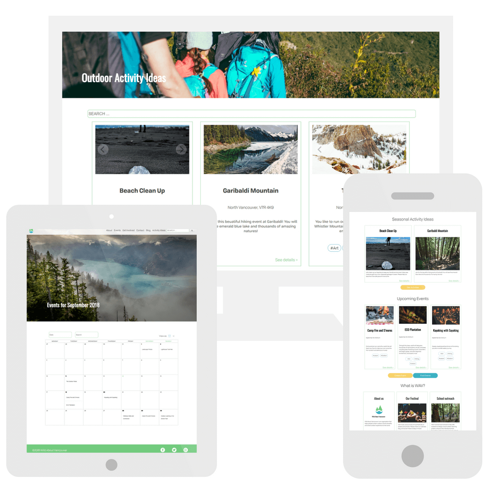

<!-- Main -->

<!-- One -->
<section id="one">
	

		<header class="major">
			<h2>how I work</h2>
		</header>
		
For me, a website is not just a bunch of code lines, displaying nice visuals at the end. It is a living place that needs to suit the emotions and fulfill certain business needs. I choose my programming stack based on project requirements, but my first choice for a client website is a free, developer-ready WordPress installation.

	

</section>

<!-- Two -->
<section id="two" class="spotlights inner">
	<section class="website-item">
		
		

			

				<header class="major">
					<h3>All Interiors WordPress site</h3>
				</header>
						
winter-spring 2019.

						<ul>
						<li>3 sites WordPress page, coded based on delivered design project, with Elementor framework</li>
						<li>post-maintenance package added: quaterly WordPress updates, Google Analytics and SEO reports</li>
						</ul>
				<ul class="actions">
					<li><a href="https://allinteriors.ca/" class="button">see the website</a></li>
				</ul>
			

		

	</section>
	<section class="website-item">
		
		

			

				<header class="major">
					<h3>Patricia Pawlak portfolio WordPress site</h3>
				</header>
						
fall 2018.

						<ul>
						<li>very clean, modern design and development based on free, tweaked WordPress theme</li>
						<li>project in progress</li>
						</ul>
				<ul class="actions">
					<li><a href="https://patriciapawlak.com/" class="button">[soon]see the website</a></li>
				</ul>
			

		

	</section>
	<section class="website-item">
		
		

			

				<header class="major">
					<h3>Polish Women Circle in Bristol WordPress site</h3>
				</header>
						
fall 2018.

						<ul>
						<li>pro bono project for women community. Women in Bristol, UK, reached out to me, asking about organizing Polish meetings (I have some know-how, since I am doing this since 2016). I offered to build website for them so they can invite more women</li>
						<li>design and developed one page project, based on Elementor framework</li>
						</ul>
				<ul class="actions">
					<li><a href="http://babskiespotkania.co.uk/" class="button">see the website</a></li>
				</ul>
			

		

	</section>
	<section class="website-item">
		
		

			

				<header class="major">
					<h3>Canvas salon WordPress site</h3>
				</header>
						
spring - summer 2018.

						<ul>
						<li>redesign existing WordPress site based on the chosen, commercial theme.</li>
						<li>configure plugins and migration to the new hosting</li>
						<li>SEO adjustment</li>
						<li>content creation: text + photos</li>
						</ul>
				<ul class="actions">
					<li><a href="https://www.canvassalon.ca/" class="button">see the website</a></li>
				</ul>
			

		

	</section>
	<section class="website-item">
		
		

			

				<header class="major">
					<h3>Wild About Vancouver WordPress site</h3>
				</header>
				
summer -autumn 2018.

					<ul>
						<li>final, team project of Web Development Professional Program at RED Academy, Vancouver</li>
						<li>coded a multipage website based on delivered mockup</li>
						<li>used developer theme, _underscore</li>
						<li>customized paid plugin: event calendar</li>
						<li>deployment ongoing, with code tweaks and adjustment of existing content</li>
					</ul>
				<ul class="actions">
					<li><a href="#" class="button">[soon]see the website</a></li>
				</ul>
			

		

	</section>
	<section class="website-item">
		
		

			

				<header class="major">
					<h3>Kasia i kod WordPress blog</h3>
				</header>
					<ul>
						<li>my first customized WordPress theme, child theme of twenty sixteen</li>
						<li>custom WP query, custom post types and WordPress templates</li>
						<li>full integration with newsletter system, social media feeds and Google Analytics</li>
						<li>CSS and HTML changes of the plugin: Maintenance and coming soon, so it matched the website brand</li>
						<li>designed and optimized all webiste graphics</li>
					</ul>
				<ul class="actions">
					<li><a href="https://www.kasiaikod.pl/" class="button">[pol]see the website</a></li>
				</ul>
			

		

	</section>
	<section class="website-item">
		
		

			

				<header class="major">
					<h3>Inhabitent store WordPress site</h3>
				</header>
						
first WordPress theme and plugin development.

				<ul class="actions">
					<li><a href="https://github.com/pinaska/inhabitent_multisite_WP_theme" class="button">check the code</a></li>
				</ul>
			

		

	</section>
	<section class="website-item">
		
		

			

				<header class="major">
					<h3>We create RWD site</h3>
				</header>
				
spring 2018.

				
Website coded from PSD, fully responsive, no library used

				<ul class="actions">
					<li><a href="https://pinaska.github.io/we_create_rwd_one_page_site/" class="button">demo</a></li>
				</ul>
			

		

	</section>
	<section class="website-item">
		
		

			

				<header class="major">
					<h3>Aloha RWD site</h3>
				</header>
				
spring 2018.

				
My first school project coded from PSD, responsive | vanilla JS used

				<ul class="actions">
					<li><a href="https://pinaska.github.io/aloha_webiste_one-page/" class="button">demo</a></li>
				</ul>
			

		

	</section>
	<section class="website-item">
		
		

			

				<header class="major">
					<h3>Personal website 1.0</h3>
				</header>
				
winter 2018.

				<ul>
				<li>My first website, and it is responsive!</li>
				<li>first line of JavaScript - button asking what is my favourite furniture store</li>
				</ul>
				<ul class="actions">
					<li><a href="https://pinaska.github.io/kate_jeziorska_one-page_website/" class="button">demo</a></li>
				</ul>
			

		

	</section>
</section>

